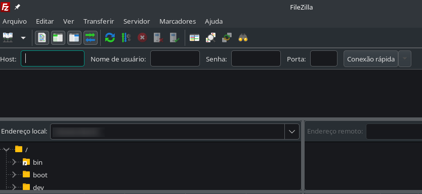
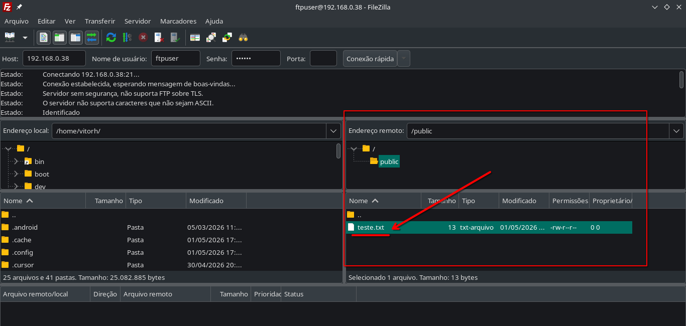

# Tutorial atividade 07 - FTP

### Vitor Hugo Boaventura da Silva

Adaptado do [tutorial produzido por Caian Santana
](https://docs.google.com/document/d/1qwJCIU-pSPB7-klefBeOGk3s-FQBea6X1xyu8QhZEyM/edit?tab=t.0#heading=h.3cod0n8abz08) para as [máquinas virtuais Debian 12](https://drive.google.com/drive/folders/1nGR5_DV5u7J-jm3upk0B82C3EsvlfjlT?usp=sharing).

# Objetivo

Instalar e configurar o vsftpd (servidor FTP) na VM, permitindo acesso remoto a arquivos através do File Transfer Protocol (FTP, Protocolo de Transferência de Arquivo).

A título de conhecimento, vsftpd é a sigla de Very Secure FTP Daemon, que pode ser traduzido como Servidor FTP extremamente seguro.

---

## Configuração prévia da VM

Anstes de iniciar a máquina virtual, realize as seguintes configurações de rede.

1. Vá em Configurações
2. Aba Rede
3. Configure como:

```
Adaptador em modo Bridge (Bridge Adapter)
```

Se desejar acessar a VM via conexão ssh, siga os dois passos a seguir.

---

### Descobrir IP

Com a máquina virtual funcionando, descubra o ip com o seguinte comando.

```bash
ip a
```

Anote o IP porque você precisará dele depois.
Se desejar acessar a máquina virtual via conexão SSH, o IP da VM também será útil aqui. Na máquina host:

```bash
ssh root@<IP_DA_VM>
```

# Atividade

---

## 1. Instalação do VSFTPD

Primeiramente, vamos instalar o servidor FTP:

```bash
apt install -y vsftpd
```

## Feito isso, podemos seguir para a configuração do vsftpd.

## 2. Configuração do VSFTPD

Edite o arquivo de configuração do servidor com o seguinte comando:

```bash
nano /etc/vsftpd.conf
```

Configure as informações abaixo no arquivo. Para localizá-las mais facilmente, utilize `CTRL + W`. É possível que algumas delas estejam comentadas, como `#chroot_local_user=YES`. Nesse caso, remova o #.

```
anonymous_enable=NO
local_enable=YES
chroot_local_user=YES
```
Adicione a seguinte informação nesse arquivo par ativar o modo passivo:

```
pasv_enable=YES
```

Salve as alterações.

Depois, reinicie o servidor FTP para que as alterações sejam aplicadas:

```bash
systemctl restart vsftpd
```

---

## 3. Criar usuário FTP

Agora iremos criar um usuário para acesso FTP e configurá-lo.
Execute um a um os comandos a seguir.

Criar o grupo `ftpusers`:

```bash
groupadd ftpusers
```

Criar um usuário `ftpuser` e adicioná-lo ao grupo:

```bash
useradd -g ftpusers ftpuser
```

Definir uma senha para o usuário criado:

```bash
passwd ftpuser
```

`Após executar o comando, digite a senha e pressione ENTER`
`Repita a senha e pressione ENTER novamente para confirmar`

`LEMBRE DESSA SENHA, ELA É IMPORTANTE!!!`

Criar um diretório `ftpuser` para o usuário e um diretório `public` dentro dele:

```bash
mkdir -p /home/ftpuser/public
```

Alterar para o usuário `ftpuser` do grupo `ftpusers` a propriedade do diretório `/home/ftpuser`:

```bash
chown -R ftpuser:ftpusers /home/ftpuser
```

Por segurança, remover a permissão de escrita da pasta `/home/ftpuser` para todos os usuários:

```bash
chmod a-w /home/ftpuser
```

O retorno esperado é algo assim:

```
drwx------ 3 debian  debian    4096 Mar 16 17:06 debian
dr-xr-xr-x 3 ftpuser ftpusers  4096 May  1 15:49 ftpuser
drwx------ 2 root    root     16384 Jul 11  2023 lost+found
```

Checar as permissões:

```bash
ls -l /home
```

Para testar, crie um arquivo `.txt` na pasta reservada, digite algum texto nele e salve:

```bash
nano /home/ftpuser/public/teste.txt
```

Ok, a configuração do servidor FTP está pronta, e o arquivo de teste está criado. A partir de agora trabalharemos na máquina host. Lembre-se que o IP da VM será necessário. Você pode obte-lo com `ip a` ou `ifconfig -a` (se o net-tools estiver instalado).

---

## 4. Teste com FileZilla (máquina Host)

Instale o FileZilla em sua máquina através desse [link](https://filezilla-project.org/download.php?type=client). Escolha a opção adequada para o sistema operacional da sua máquina host.

Ao executar o FileZilla, você verá algo parecido com a imagem abaixo na interface gráfica.



Observe os campos na parte superior da imagem. Preencha-os assim:

- Host: <IP_da_VM>
- Usuário: ftpuser
- Senha: <senha_que_voce_definiu>
- Porta: 21

Então clique em `Quickconnect`(ou `Conexão rápida`). O resultado esperado é algo como:

``` no-copy
Status:	Connecting to <ip_vm>:21...
Status:	Connection established, waiting for welcome message...
Status:	Insecure server, it does not support FTP over TLS.
Status:	Logged in
Status:	Retrieving directory listing...
Status:	Directory listing of "/" successful
```

Quando a conexão for estabelecida, será possível visualizar a pasta criada na máquina virtual, conforme a imagem abaixo.



Verifique o arquivo `/public/teste.txt`. Experimente baixar e abrir este arquivo e veja o texto que você salvou nele.

Se funcionar normalmente, a atividade está concluída com sucesso!