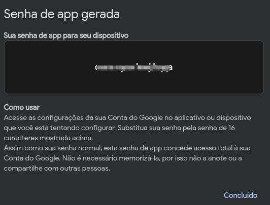

# Atividade 08 - SMTP

### Vitor Hugo Boaventura da Silva

Adaptado do [tutorial de Caian Santana](https://docs.google.com/document/d/1qwdUeoJlS4PSbZm01L1_YvTRXYgEf83i7acw_hJVDeM/edit?usp=sharing)


## Descrição da atividade

O objetivo da atividade é criar uma API HTTP simples para envio de e-mails utilizando o protocolo SMTP. A implementação pode ser feita em qualquer linguagem de programação com suporte a aplicações Web. A API deve expor um endpoint HTTP capaz de receber requisições do tipo POST. Ao receber uma requisição, os dados enviados no corpo da requisição (destinatário, assunto e corpo do e-mail) devem ser utilizados para enviar um e-mail para o destinatário especificado.

Para garantir o funcionamento, será necessário configurar um e-mail remetente padrão que será usado para autenticação no servidor SMTP. Neste exemplo, utilizaremos o Gmail como servidor SMTP, que exige o uso de uma senha de aplicativo específica para a autenticação. Essa senha deve ser gerada nas configurações de segurança da conta Gmail e configurada na aplicação.


## Tutorial da atividade

### 1. Pré-requisitos

Só existem 2 pré-requisitos para essa atividade:

1. Ter o Python instalado na sua máquina;
2. Possuir um e-mail.

Não será necessário utilizar máquinas virtuais.

### 2. Configuração do Gmail

1. Acesse qualquer página do Google, clique no ícone da sua conta e depois em “Gerenciar sua Conta do Google”.


2. Em Segurança, ative a Verificação em Duas Etapas, caso ainda não tenha ativado.
3. Na barra de pesquisa, busque por “senhas de app” e clique nela.
4. O Google pedirá novamente sua senha.
5. Após isso, a tela de criação de senha de aplicativo aparecerá.
6. Escolha um nome para o app e clique em “Criar”.
7. Uma senha será gerada e você poderá utilizá-la para enviar e-mails via SMTP. ANOTE ESSA SENHA!



### 3. Criando a conexão com o servidor SMTP do Gmail

Em uma pasta, vamos criar três arquivos `.py`.
O primeiro será o `Smtpconn.py`, utilizado para realizar a conexão SMTP:

```python
import smtplib

class SmtpConn:
    def __init__(self, sourceMail, password):
        self.mail = sourceMail
        self.connection = smtplib.SMTP("smtp.gmail.com", 587)
        self.connection.ehlo()
        self.connection.starttls()
        self.connection.login(self.mail, password)

    def sendMail(self, destinationMail, subject, message):
        try:
            self.connection.sendmail(
                self.mail,
                destinationMail,
                "Subject: " + subject + "\n{}".format(message),
            )
            response = "Email enviado com sucesso!\n"
            print(response)
            return response
        except Exception:
            response = "Erro ao enviar e-mail!\n"
            print(response)
            return response
```

Como esse script funciona:

- Ao instanciar um objeto do tipo `SmtpConn` com o e-mail remetente e sua senha, o objeto chama a função `ehlo()` para dar um “Hello” ao servidor do Gmail ao estabelecermos a conexão;
- Como estamos utilizando a porta 587, precisamos chamar a função `starttls()`, que irá criptografar nossa conexão;
- A função `login(email, password)` irá logar nossas credenciais no servidor.

Esse objeto possui a função `sendMail`, onde é passado o e-mail destinatário, título e mensagem.

Depois, criamos o arquivo `env.py` com as variáveis referentes ao e-mail e à senha gerada. Você deve atribuir valores às variáveis:

```python
EMAIL = "<seu_email>"
PASS = "<senha_gerada_na_conta_google>"
```
E então sequimos para a criação do servidor HTTP.

### 4. Criando o servidor HTTP

Esse será o script responsável por recuperar os dados do arquivo `env.py`, se conectas ao servidor SMTP, iniciar o servidor HTTP e, por fim, esperar requisições.

O script `controller.py` ficará assim:

```python
from http.server import BaseHTTPRequestHandler, HTTPServer
from Smtpconn import SmtpConn
from env import EMAIL, PASS
import json
import logging

logging.basicConfig(level=logging.INFO)

try:
    smtpConn = SmtpConn(EMAIL, PASS)
    print("Conectado com sucesso ao email.")
except Exception:
    print("Falhou ao conectar com Email.")
    exit()

class SimpleHTTPRequestHandler(BaseHTTPRequestHandler):
    def do_POST(self):
        if self.path == "/":
            content_length = int(self.headers["Content-Length"])
            post_data = self.rfile.read(content_length)
            try:
                data = json.loads(post_data)
                response = smtpConn.sendMail(
                    data["email"],
                    data["subject"],
                    data["message"],
                )
                self._send_response(201, response)
            except json.JSONDecodeError:
                self._send_response(400, {"error": "Invalid JSON"})
        else:
            self._send_response(404, {"error": "Invalid endpoint"})

    def _send_response(self, status_code, body):
        self.send_response(status_code)
        self.send_header("Content-Type", "application/json")
        self.end_headers()
        self.wfile.write(json.dumps(body).encode("utf-8"))

if __name__ == "__main__":
    server_address = ("", 8080)
    httpd = HTTPServer(server_address, SimpleHTTPRequestHandler)
    print("Servidor rodando em http://127.0.0.1:8080")
    httpd.serve_forever()
```

### 5. Enviando um e-mail

Ative seu ambiente virtual python e execute o script `controller.py`:

```bash
python controller.py
```
Dessa forma, o servidor SMTP estará pronto para receber requisições.

Há algumas formas de fazer essa requisição POST, como usando Insomnia ou Postman. Aqui é utilizado o `curl`.

--- 
    Se o seu sistema operacional for Windows, será necessário utilizar WSL ou adaptar o comando ao seu contexto.
---
Execute o comando abaixo no terminal, alterando os valores de `email`, `subject` e `message`. O ideal é utilizar um email que você tenha acesso para verificar se a mensagem foi recebida.

```bash
curl -k -X POST -H "Content-Type: application/json" --data '
{"email":"<email>","subject":"<assunto do email>","message":"<corpo do email>"}' localhost:8080
```
Verifique se o email chegou na caixa de entrada. Se chegou, a atividade foi realizada com sucesso.